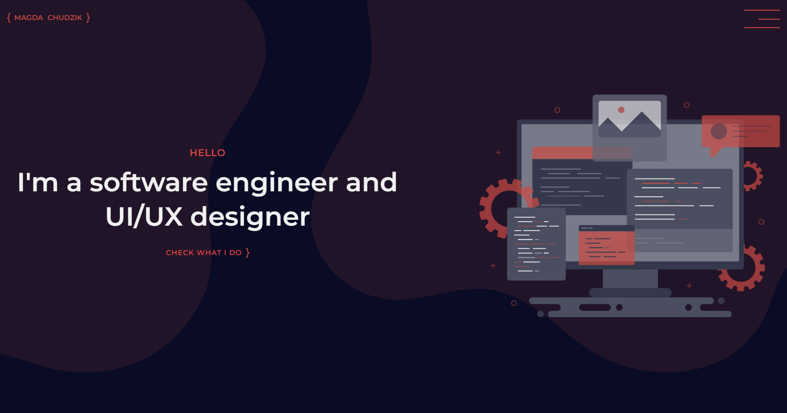
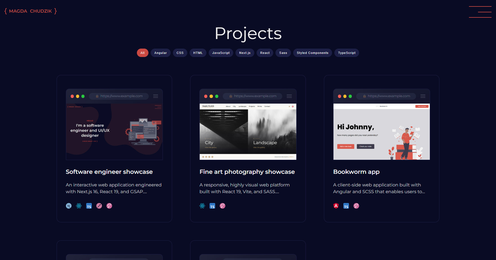
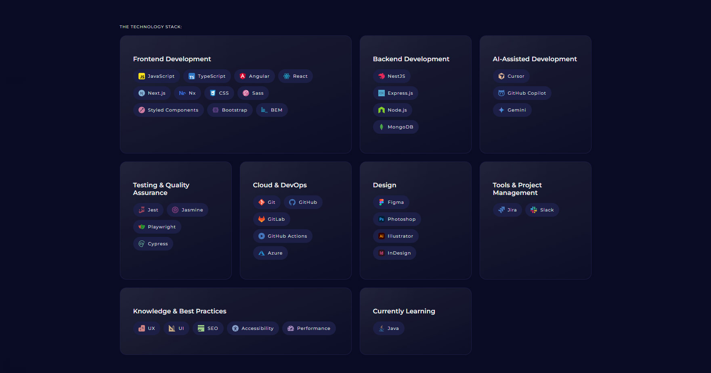
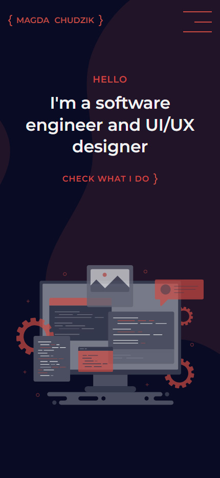
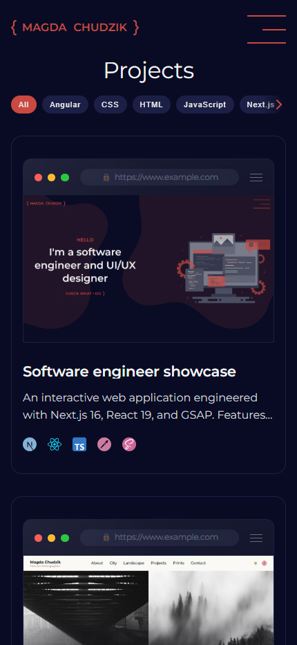

# Developer Showcase App

A high-performance web application built with **Next.js 16**, **React 19**, and **TypeScript**, featuring dynamic **GSAP** animations and modular **styled-components**.

---

## 🚀 Tech Stack

- **Framework:** [Next.js 16](https://nextjs.org/) (App Router & Turbopack)
- **Library:** [React 19](https://react.dev/)
- **Language:** [TypeScript](https://www.typescriptlang.org/)
- **Styling:** [styled-components](https://styled-components.com/)
- **Animations:** [GSAP](https://gsap.com/) (`@gsap/react`)
- **Code Quality:** ESLint, Prettier, React Compiler

---

## 🛠️ Features & Optimizations

- **Turbopack Support** - Fast local development and optimized build pipeline.
- **Modern Animation Architecture** - Smooth UI/UX transitions using GSAP context hooks.
- **Strict Code Quality** - Unified linting and formatting configuration (`eslint`, `prettier`, `typescript-eslint`).
- **React Compiler** - Enabled via Babel integration for optimal rendering performance.

---

## 📦 Getting Started

### 1. Installation

Install project dependencies using `npm`:

```bash
npm install
```

### 2. Running Locally

Start the local development server with `Turbopack HMR` enabled:

Bash:

```bash
npm run dev
```

Open `http://localhost:3000` in your browser to view the application.

---

## 🖼️ Mockups







<table>
	<tr>
		<td></td>
		<td></td>
	</tr>
</table>
